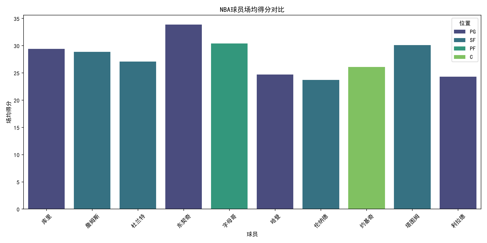
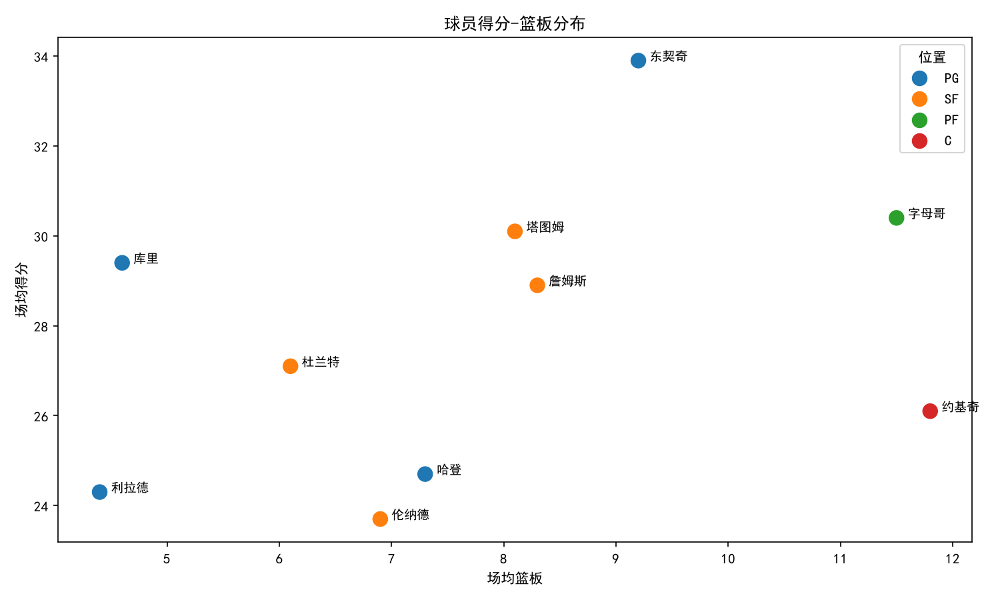
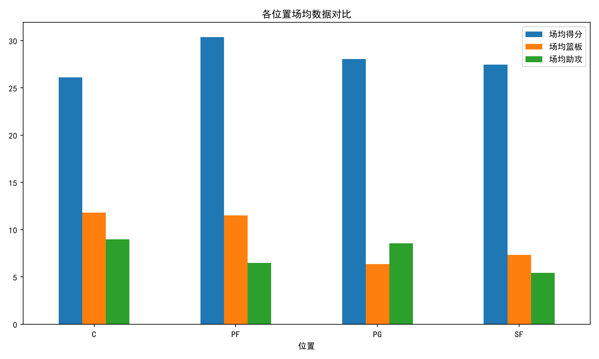

# NBA球员数据分析可视化
使用Python对NBA球员数据进行探索性分析和可视化，包括球员得分分布、位置对比。

## 技术栈
- Python 3.x
- Pandas（数据处理）
- Matplotlib / Seaborn（数据可视化）

## 项目结构
- nba_analysis.py - 主分析脚本
- data/ - 数据文件
- charts/ - 可视化图表

## 运行方式
```bash
pip install pandas matplotlib seaborn
python nba_analysis.py
## 可视化结果




## 项目总结
本项目利用Python Pandas构造NBA球员模拟数据集，完成数据查看与统计分析，借助Matplotlib、Seaborn绘制多张可视化图表，直观对比球员得分、篮板数据，分析不同场上位置的球员数据特征。

## 作者
- 刘沅洛 - 武汉体育学院 数据科学与大数据技术

